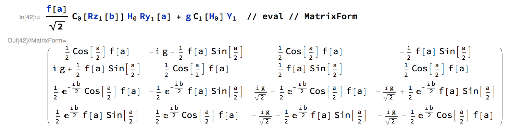

Unitary Builder
===============

This notebook offers a simple `eval` function which will evaluate gates (and states) as matrices.
This is useful for performing quick symbolic algebra on the unitaries or states produced by short circuits.

For example, denoting the target qubit as a subscript (which we here underline)
```Mathematica
>>> eval[X_0 Y_1]
{{0, 0, 0, -I}, {0, 0, I, 0}, {0, -I, 0, 0}, {I, 0, 0, 0}}

>>> C_0[X_1] H_0 Rz_1[ PI ] // eval
{{-I/Sqrt[2], 0, -I/Sqrt[2], 0}, 
 {0, I/Sqrt[2], 0, I/Sqrt[2]}, 
 {0, I/Sqrt[2], 0, -I/Sqrt[2]}, 
 {-I/Sqrt[2], 0, I/Sqrt[2], 0}}
```

Gates can be linearly combined:


Bras and kets can be intermixed, where `Ket[3]` indicates the *fourth* computational basis state (`11` in binary):


The number of qubits in the system is assumed to be the largest indexed in the expression.
E.g. `H_0 Y_5` returns a 6 qubit (2^6 by 2^6) matrix.

Supported gates
---------------
`H`, `X`, `Y`, `Z`, `Rx`, `Ry`, `Rz`, `C` (which wraps any of the preceeding gates)
in addition to `Bra` and `Ket`
